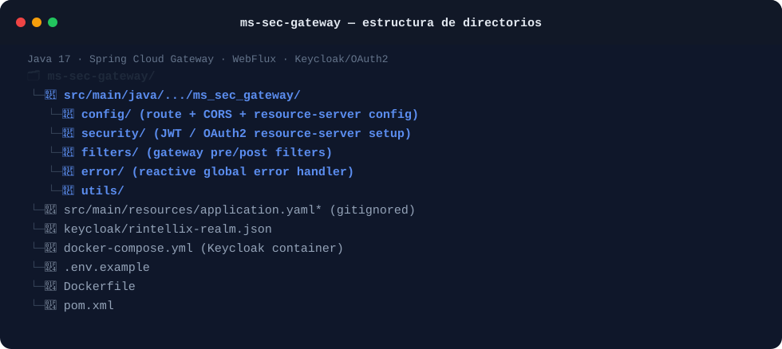

# ms-sec-gateway

**Puerta de enlace (API gateway) y perímetro de seguridad de la plataforma RIntellix.**

`Java 17` · `Spring Cloud Gateway` · `Spring WebFlux` · `Keycloak / OAuth2`

---

## 1. Descripción general

`ms-sec-gateway` es el único punto de entrada para todo el tráfico externo hacia RIntellix. Es
una puerta de enlace reactiva construida con Spring Cloud Gateway que:

- Enruta las peticiones entrantes hacia el microservicio de destino correspondiente
  (`ms-core-data`, `ms-risk-engine`, …).
- Valida los tokens de acceso OAuth2/JWT emitidos por **Keycloak** antes de permitir el paso de
  una petición.
- Centraliza aspectos transversales (CORS, formato de errores, filtrado de peticiones) para que
  los servicios de destino no tengan que reimplementarlos.

Aquí no reside lógica de negocio: su única responsabilidad es *autenticar, enrutar, proteger*.

## 2. Aspectos clave del sistema

- **Gateway reactivo y no bloqueante.** Construido con
  `spring-cloud-starter-gateway-server-webflux` sobre Project Reactor, adecuado para hacer de
  proxy de muchas llamadas concurrentes a los servicios de destino de forma eficiente.
- **Validación como servidor de recursos OAuth2.** `spring-boot-starter-oauth2-resource-server`
  valida los tokens *bearer* entrantes contra el emisor de Keycloak configurado en
  `KEYCLOAK_ISSUER_URI`. La lógica de token/roles reside en `security/`.
- **Filtros de gateway personalizados.** `filters/` contiene los filtros pre/post aplicados a
  las peticiones enrutadas (p. ej., propagación del contexto de autenticación, *logging*).
- **Gestión de errores reactiva centralizada.** `error/` implementa un manejador global para que
  los fallos a nivel de gateway (fallos de autenticación, errores de enrutado, timeouts de los
  servicios de destino) devuelvan un formato de error consistente en lugar de exponer trazas de
  pila específicas del framework.

### Estructura del repositorio

El siguiente esquema ilustra la distribuci�n del c�digo fuente y c�mo las piezas clave de la arquitectura descrita encajan en las carpetas principales del proyecto:



## 3. Tecnologías

- **Lenguaje / runtime:** Java 17
- **Framework:** Spring Cloud Gateway (reactivo, basado en WebFlux)
- **Seguridad:** Spring Security + OAuth2 Resource Server, Keycloak 26.4 como proveedor de identidad
- **Utilidades:** Lombok

## 4. Requisitos previos

- JDK 17 o superior
- Maven 3.9+
- Docker y Docker Compose (para ejecutar Keycloak en local)
- Los servicios de destino a los que enruta este gateway (`ms-core-data`, `ms-risk-engine`)
  accesibles en las URLs configuradas más abajo

## 5. Puesta en marcha

> `**IMPORTANTE**`
>
> **Global platform deployment**:
> Este repositorio contiene únicamente el código del gateway. Para levantar la plataforma RIntellix completa (incluyendo este servicio, Keycloak y el resto de microservicios), clona el repositorio principal de infraestructura **[TFG-RIntellix/rintellix-deployment]** y sigue sus instrucciones.

Los siguientes comandos se proporcionan para el desarrollo local, revisión de código y compilación:

```bash
# 1. Clonar el repositorio
git clone https://github.com/TFG-RIntellix/ms-sec-gateway.git
cd ms-sec-gateway

# 2. Preparar el fichero de entorno
cp .env.example .env
# edita .env si necesitas puertos o credenciales distintos

# 3. Compilar el proyecto
mvn clean package -DskipTests
```

El gateway escucha por defecto en el **puerto 8080** configurado mediante `GATEWAY_PORT`.

## 6. Configuración

Variables de entorno (ver `.env.example`):

| Variable | Descripción | Valor por defecto |
|---|---|---|
| `KEYCLOAK_ADMIN` | Usuario de la consola de administración de Keycloak (solo desarrollo local) | `admin` |
| `KEYCLOAK_ADMIN_PASSWORD` | Contraseña de la consola de administración de Keycloak (solo desarrollo local) | `admin` |
| `GATEWAY_PORT` | Puerto en el que escucha el gateway | `8080` |
| `KEYCLOAK_ISSUER_URI` | URI del emisor OAuth2 usada para validar los tokens | `http://localhost:8180/realms/rintellix` |
| `MS_CORE_DATA_URI` | URL base de `ms-core-data` | `http://localhost:8081` |
| `MS_RISK_ENGINE_URI` | URL base de `ms-risk-engine` | `http://localhost:8082` |

> `application.yaml*` / `application.properties*` están excluidos del repositorio: las
> definiciones de rutas y la configuración del resource server deben referenciar las variables
> anteriores.

## 7. Servicios relacionados

- **ms-core-data**, **ms-risk-engine** — servicios de destino a los que enruta este gateway.
- **Keycloak** — proveedor de identidad para la validación de tokens OAuth2.

## 8. Autora

Lucía Fernández Mancebo — TFG *RIntellix*, Universidad de Cantabria.


